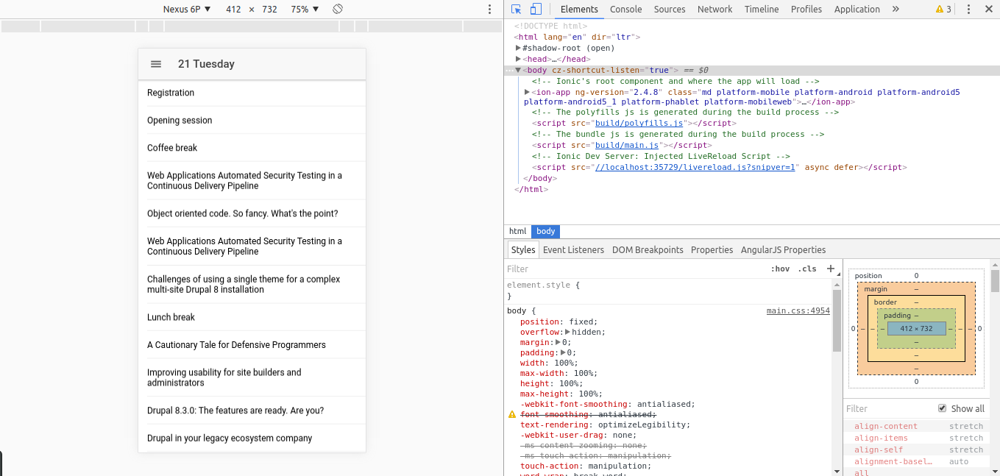
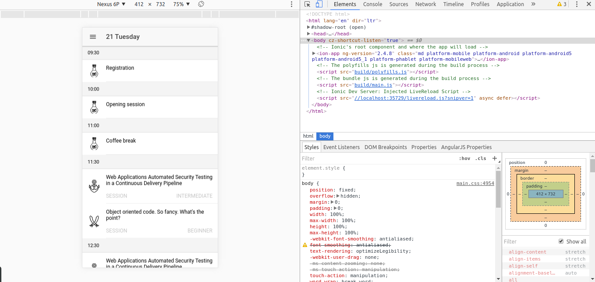

# Step 03 Populating the Program Page

[**1. Getting data from Drupal**](#1-getting-data-from-drupal)

[**2. Transforming the response**](#2-transforming-the-response)

[**3. Representing data**](#3-representing-data)

[**4. Making things pretty**](#4-making-things-pretty)

## 1. Getting data from Drupal

It's time to give some content to our **Program Page**. But to do it we must get data from somewhere and here is where 
the RESTful api we prepared on Drupal comes into play.

In order to keep separation of concerns Ionic uses classes called **Providers**. These classes are normal plain classes 
decorated with the ```@Injectable()``` decorator to allow dependency injection. These classes are singletons, so we can 
consider them as a way to share information across the application and as a way to store the state of the application. 

We will use the **Ionic CLI** again to generate the provider we need by typing in the project folder:
```bash
ionic g provider program
```

This will create a _program.ts_ file in a providers folder. I consider good practice to rename this file to **program.service.ts** 
so it's easier to know the content of the file and to differentiate it from the _program.ts_ page file. We should also 
rename the class to **ProgramService**.

Prior to use our service we must declare it in our module, so we will go to our _app.module.ts_ and add it to the providers 
array with its corresponding import statement.

This class the Ionic CLI created for us has already injected the Http class (we should make it private). This is the class we 
use to perform requests. 

We will start by declaring a couple of constants that we will need: the **base url** for our requests and an object to relate dates with **Drupal nodes**.

```typescript
private readonly drupalUrl = 'http://your-ip/devdaysseville/api/program';

private readonly dates = {
  '2017-03-21': 55,
  '2017-03-22': 56,
  '2017-03-23': 57,
  '2017-03-24': 258,
  '2017-03-25': 259,
};
```

No we create a method to get a program by its date. This method receives a Moment object representing the date and returns an Observable, which is:
> A representation of any set of values over any amount of time. This the most basic building block of RxJS.

It's, then, a construct of [RxJs](http://reactivex.io/rxjs/) the javascript implementation for **Reactive Programming**. 
Our method, for now, just makes the requests and gets the data from the response:

```typescript
getProgram(date: Moment): Observable<any[]> {
  const programId = this.dates[date.format('YYYY-MM-D')];

  return this.http
             .get(`${this.drupalUrl}/${programId}`)
             .map(res => res.json());
}
```
Don't forget to import Observable and Moment in the program.service.ts
```
import { Observable } from 'rxjs/Observable';
import * as moment from 'moment';
import Moment = moment.Moment;
```

We will improve this method later, now we are gonna give it a try.
We will go back to our _program.ts_ file and add a new method called **ionViewDidLoad**. This method is a lifecycle hook 
and it will be called by Ionic once the page has been loaded. It's then the moment to request the asynchronous content of the page.

In this method we will call our service method and then subscribe to the result and print it to the console to check if it's working:
```typescript
ionViewDidLoad() {
  this.programService.getProgram(this.navParams.data as Moment)
      .subscribe(program => console.log(program));
}
```

Maybe your IDE is warning you that _this.programService_ was not defined. You need to import _ProgramService_ and inject it in our class like this:
```typescript
constructor(public navCtrl: NavController, 
            private navParams: NavParams, 
            private programService : ProgramService) {
    this.title = (this.navParams.data as Moment).format('DD dddd');
  }
```

This is how **Dependency Injection** works in Angular 2, the framework will take care of injecting the instance of ProgramService for you.

You should now be getting something like this:


## 2. Transforming the response

Now that we have the data from the Drupal backend we need to adapt it to our needs. Inspecting the response we can see 
that there are three different types of entities mixed in the program: sessions, keynotes and breaks. As for our needs 
we can consider all of them as a single entity or class: **Session**.

Then we need to define this **Session** as an _interface_ or as a _class_. We will pick a class so we delegate the 
responsibility of creating an instance of the class from the raw response to the class itself. We will create a new 
_session.ts_ typescript file in a new **shared** folder.

This is what we need right now, we will refactor the class as we need it.

```typescript
export class Session {
  id: string;
  title: string;
  startTime: string;
  endTime: string;
  level?: string;
  track?: string;
  type?: string;
  venue?: string;
}
```

We can add now a constructor that takes one of the objects from Drupal an returns a Session object.

```typescript
constructor(rawSession: any = {}) {
  const times = rawSession.field_start_end_period ? rawSession.field_start_end_period.split('-') : null;

  this.id = rawSession.nid;
  this.title = rawSession.field_break_title || rawSession.title;
  this.startTime = times && times[0].trim();
  this.endTime = times && times[1].trim();
  this.level = rawSession.field_session_level;
  this.track = rawSession.field_session_track_type;
  this.type = rawSession.type;
  this.venue = rawSession.field_break_description || rawSession.field_room;
}
```

We can use this new class definition to map our response adding a new map statement in our service and change the returned 
type to Observable<Session[]> (don't forget to import Session class):
```typescript
getProgram(date: Moment): Observable<Session[]> {
  const programId = this.dates[date.format('YYYY-MM-D')];

  return this.http
             .get(`${this.drupalUrl}/${programId}`)
             .map(res => res.json())
             .map(rawSessions => rawSessions.map(rawSession => new Session(rawSession)));
}
```

We also can take advantage of the typing and sort the response by its starting date adding a new map statement and a couple 
of helper functions:
```typescript
getProgram(date: Moment): Observable<Session[]> {
  const programId = this.dates[date.format('YYYY-MM-D')];

  return this.http
             .get(`${this.drupalUrl}/${programId}`)
             .map(res => res.json())
             .map(rawSessions => rawSessions.map(rawSession => new Session(rawSession)))
             .map(sessions => sessions.sort((s1: Session, s2: Session) => this.compareTimes(s1.startTime, s2.startTime)));
}

private compareTimes(time1: string, time2: string): number {
  return this.padTimeWithZeros(time1).localeCompare(this.padTimeWithZeros(time2));
}

private padTimeWithZeros(str: string): string {
  return ('0' + str).substr(-5);
}
```

## 3. Representing data

We're ready to show some data in our page. We will use an [Ionic 2 List](http://ionicframework.com/docs/v2/components/#lists) 
in combination with an [Ionic Virtual Scroll](http://ionicframework.com/docs/v2/api/components/virtual-scroll/VirtualScroll/) to increase performance.
The first step will be to set the data we get from the service into a variable to be accessible from the view. We declare 
a _sessions_ variable of type _Session[]_ and then we swap the console.log statement for an assignation in the _program.ts_ 
file, ```this.sessions = program```.

We can then start with the markup, so we go to the program.html file. First we will define **ion-list** element  with the 
needed attributes for the **virtualScroll** with a **ion-item** with the **virtuslItem** attribute inside and we will show the title of the session:

```html
<ion-list [virtualScroll]="sessions">
  <ion-item *virtualItem="let session">
    <h2 [innerHtml]="session.title" text-wrap></h2>  
  </ion-item>
</ion-list>
```

This syntax is a little bit special. We use square brackets in an attribute to tell Angular that the value we are 
assigning to the attribute comes from a variable. In this case we are assigning to the **virtualItem** attribute (it's a 
directive, actually, an Angular construct to extend html) the array of sessions to iterate through.

The virtual scroll will set a fixed number of items in the DOM according with the size of the screen and the size of the 
items and handle the scroll just changing the content of these items. Having a DOM with less item increases performance 
dramatically since we limit the number of event listeners.

The asterisk syntax is used by directives that alter the DOM (as the ngFor was doing before). The **virtualItem** attribute 
works with the previous **virtualScroll** and provides a way to define the variable we use in the iteration.

Finally we use **innerHtml** to correctly show the titles because they contain characters defined by its ASCII code and 
**text-wrap** to allow the text to spread to as many lines as it needs.
It should look like this by now:



Next thing we need is a way to show the start time of the events. We can use [list dividers](http://ionicframework.com/docs/v2/components/#list-dividers) 
as a way to group events by start time and show this information.

So we add an **ion-item-divider** element and we will populate it using another feature of the virtual scroll api, the **headerFn**. 
This is a method that Ionic will call for each item during the iteration. We must define the method with the following signature:
```typescript
getStartTime(record, recordIndex, records): string {

}
```

With these parameters we must return the header for the given record and Ionic will take care of grouping the items that 
share the same header. So we write a method that looks like:
```typescript
getStartTime(record, recordIndex, records): string {
  if (recordIndex === 0) {
    return record.startTime;
  } else {
    return record.startTime === records[recordIndex - 1].startTime ? null : record.startTime;
  }
}
```

Now we use this method in the view by adding to the _ion-item_ element a **headerFn** attribute that refers to this method. 
We are using here a variable so we must wrap the attribute in square brackets: 
```typescript
[headerFn]="getStartTime"
```
Then we bind the returned header to our _ion-item-divider_ with a **virtualItem** attribute that allows us store that 
value in a variable to be used. So our _ion-item-divider_ will look like this:
```html
<ion-item-divider *virtualHeader="let startTime" color="light">{{startTime}}</ion-item-divider>
```

The color attribute is another feature of Ionic that allows to assign theme defined colors to elements. You can check 
this colors in [this file](./DrupalDevDays/src/theme/variables.scss). In this case we assign the light color to set a 
light gray color to our dividers. 

You should have the _item-list_ like this:
```html
<ion-list [virtualScroll]="sessions" [headerFn]="getStartTime">
    <ion-item-divider *virtualHeader="let startTime" color="light">{{startTime}}</ion-item-divider>

    <ion-item *virtualItem="let session">
      <h2 [innerHtml]="session.title" text-wrap></h2>
    </ion-item>
  </ion-list>
```

## 4. Making things pretty

Let's do our list look a little bit better by adding an image to represent the track of each session.

But first things first, download [this zip file](./images.zip) and unzip it in the _src/assets_ folder. You should end 
up with a _src/assets/images_ folder containing the ten image files we will be using.
We will use the [avatar-list](http://ionicframework.com/docs/v2/components/#avatar-list) to show this image. This image 
will depend on the type and track of session.

To achieve this we will create a method in our ProgramPage class that will return the url of the image depending on the session:
```typescript
getImage(session: Session): string {
  if (session.type) {
    const imageName: string = this.getImageNameFromTrack(session.track);
    return `assets/images/${imageName}.svg`
  } else {
    return 'assets/images/poison.svg';
  }
}

private getImageNameFromTrack(track: string): string {
  const result = track || 'other';
  return result.toLowerCase()
               .replace(' ', '-');
}
```

Now we add the **ion-avatar** element inside the _ion-item_ element to show the image:
```html
<ion-avatar item-left>
  
</ion-avatar>
```

Again we are using square brackets with the _src_ attribute because we are using a variable to define the content of the src. 
This will prevent errors loading the image while getting the url.
We also used the _item-left_ because we want our image to be shown to the left of the list.

There are yet a couple of extra fields we can show in our list: the level and the type of session.
We will use another Ionic built-in component, the **ion-note**. We want them to be placed in a new line so we will define 
a div that wraps our two **ion-note** elements. We will use the _text-uppercase_ attribute and add a little bit of styling 
to have each a note to the left and the other to the right.
```html
<div class="session-extra-info" text-uppercase>
  <ion-note>{{session.type}}</ion-note>
  <ion-note>{{session.level}}</ion-note>
</div>
```

We add the styling to the _program.scss_ file.
```scss
h2 {
  margin-bottom: 2rem !important;
}

.session-extra-info {
  ion-note:nth-child(2) {
    float: right;
  }
}
```

This is what we have so far.



The final touch, we can see that Ionic is asking as to provide an "approxItemHeight" input to ensure proper virtual scroll 
rendering, so we will add this attribute to the _ion-list_ element with a value of 106px, the most common height of our item. 
This will allow Ionic calculate the number of items it can display.

Jump to the next branch [Step 04 Populating the Session Page](https://github.com/natete/DrupalDevDays-Ionic2-Workshop/tree/Step04-Populating_the_Session_Page) 
to keep coding!
