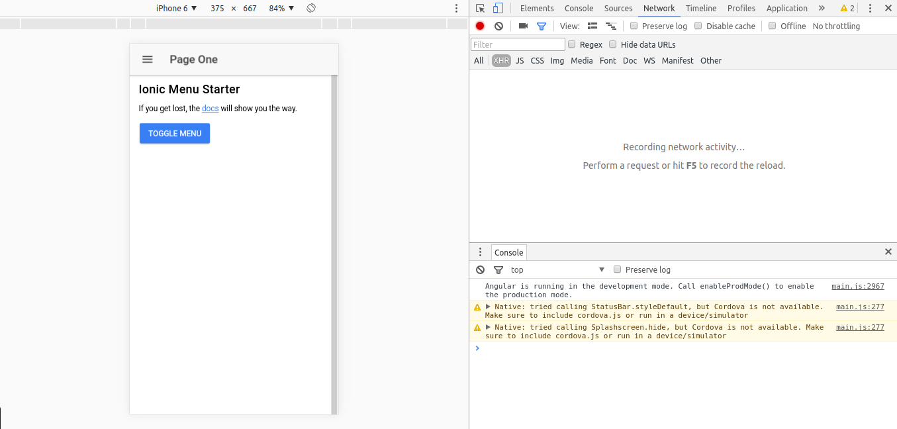

# Step01 Installing Ionic

[**1. Installing required software.**](#1-installing-required-software)

[**1.1 Installing Nodejs.**](#11-installing-nodejs)

[**1.2 Installing yarn (optional).**](#12-installing-yarn-optional)

[**1.3 Installing Ionic.**](#13-installing-ionic)

[**1.4 Installing Android SDK.**](#14-installing-android-sdk)

[**2. Create basic Ionic project.**](#2-create-basic-ionic-project)

## 1. Installing required software
 
### 1.1 Installing Nodejs

We need Node version 6.x

##### Using linux

Install required packages if not installed.

```bash
sudo apt-get install python-software-properties
```

Execute the following curl to add the needed PPA

```bash
curl -sL https://deb.nodesource.com/setup_6.x | sudo -E bash -
```

Now install nodejs

```bash
sudo apt-get install -y nodejs
```

##### Using OSX

Using Homebrew

```bash
brew install node
```

or just [download](http://nodejs.org/#download) the installer

##### Using Windows

[Download](http://nodejs.org/#download)  the installer.

##### Other OSs and further instructions

Follow the instructions from the [nodejs.org](https://nodejs.org/es/download/package-manager/) web.

### 1.2 Installing yarn (optional)

Execute:

```bash
npm i -g yarn
```

It might require sudo.

### 1.3 Installing ionic

Using yarn

```bash
yarn global add ionic cordova
```

Using npm

```bash
npm i -g ionic cordova
```

This will install both Ionic and Cordova CLI globally. Check everything is working fine executing:

```bash
ionic -v
```

### 1.4 Installing Android SDK (You won't need this until last step)

You can install Android Studio which has Android SDK files in it or just install the command line tools. (You must have Java installed)

##### Using Linux

Download [this file](https://dl.google.com/android/repository/tools_r25.2.3-linux.zip) and unzip the file anywhere in your system. Finally add the following paths to your PATH env variables (editing .bashrc)
 
```bash
ANDROID_HOME=path-to-the-folder-where-android-was-unzipped
ANDROID_TOOLS=$ANDROID_HOME/tools
ANDROID_PLATFORM_TOOLS=$ANDROID_HOME/platform-tools
```

##### Using OSX
Download [this file](https://dl.google.com/android/repository/tools_r25.2.3-macosx.zip) and unzip the file anywhere in your system. Finally add the following paths to your PATH env variables (editing .bash_profile or from command line)


##### Using Windows
Download [this file](https://dl.google.com/android/repository/tools_r25.2.3-windows.zip?hl=es-419) and unzip the file anywhere in your system. Finally add the following paths to your PATH env variables.

## 2. Create basic Ionic project

To create the ionic application we will use the Ionic CLI.

```bash
ionic start DrupalDevDays sidemenu --skip-npm --v2
```

This will create a basic working application. Go to the DrupalDevDays folder that the Ionic CLI created for us and download the node dependencies of the application.

##### Using yarn

```
yarn
```

##### Using npm
```
npm i
```

Once everything is installed you should be able to view your application using the development server.

```bash
ionic serve
```

You should now have something like this if you go to localhost:8100



Jump to the next branch [Step 02 Preparing the Ionic application](https://github.com/natete/DrupalDevDays-Ionic2-Workshop/tree/Step02-Preparing_the_Ionic_application) to keep coding!
