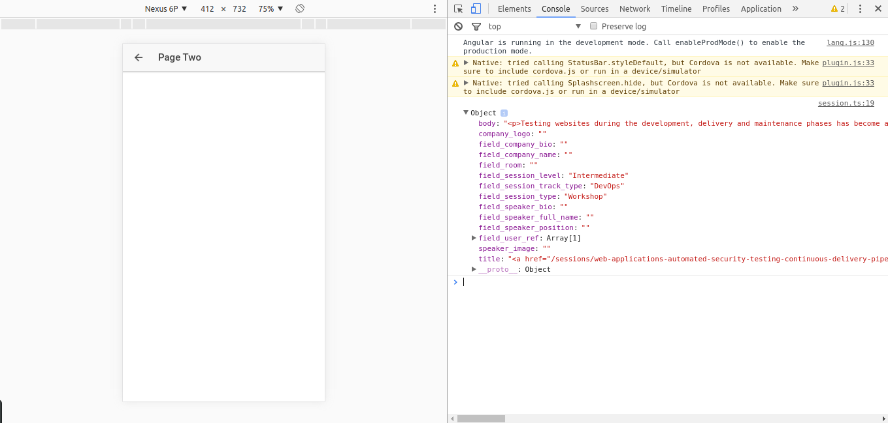
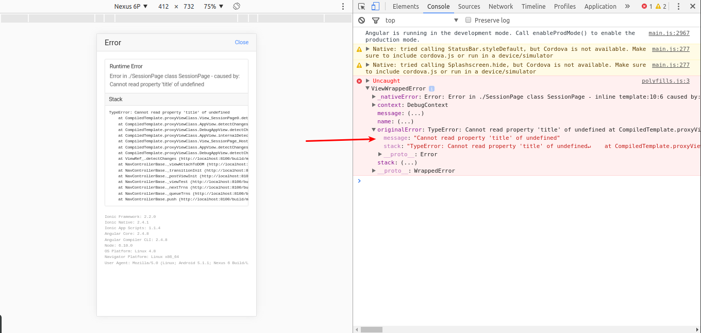
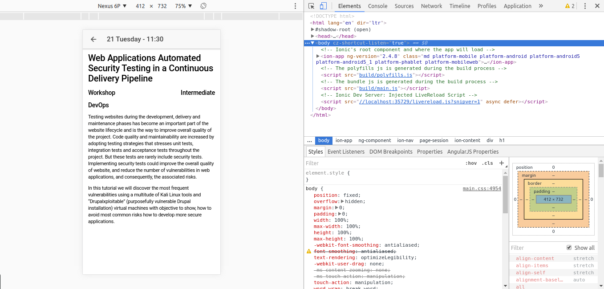
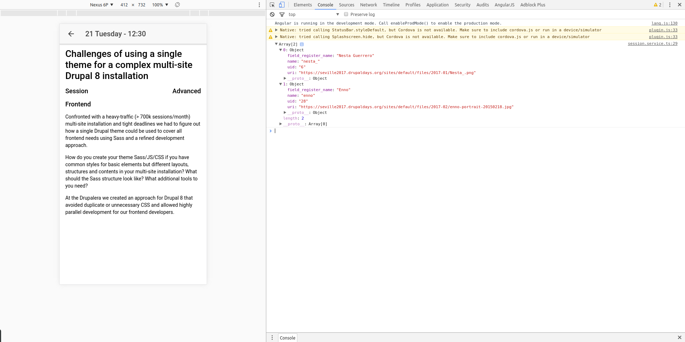
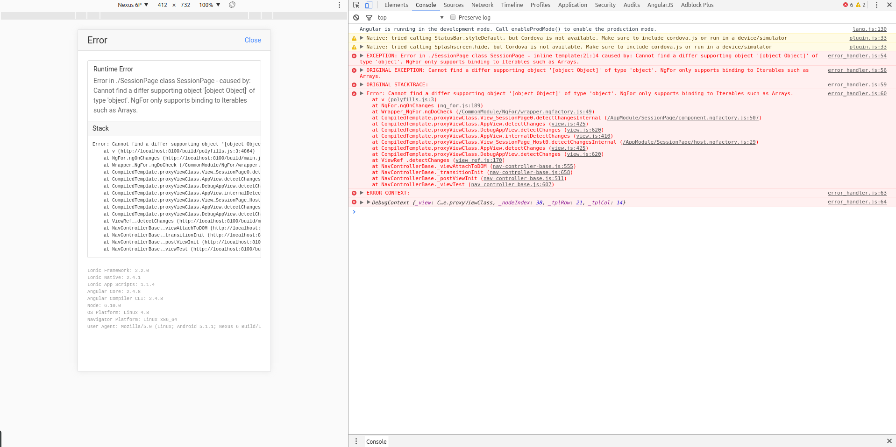
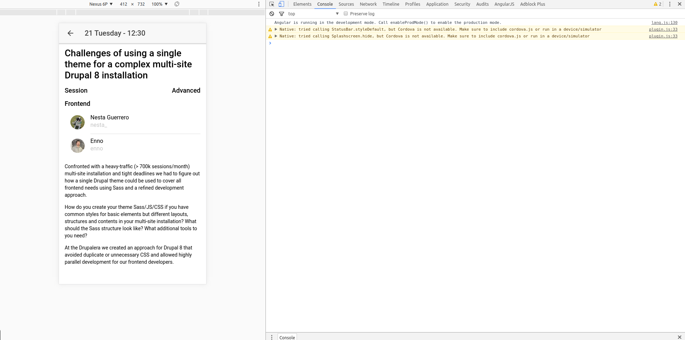

# Step 04 Populating the Session Page

[**1. Enable navigation to the Session Page**](#1-enable-navigation-to-the-session-page)

[**2. Getting the session details from Drupal**](#2-getting-the-session-details-from-drupal)

[**3. Displaying session details**](#3-displaying-session-details)

[**4. Adding speakers**](#4-adding-speakers)

## 1. Enable navigation to the Session Page

First things first. We need a way to navigate to the Session page. In this case we don't want to set the root of the 
application, instead we want to push a new page to the navigation stack.

So we will bind the _click_ event of the _ion-item_ element to a **goToSession** method in our ProgramPage class. This 
method will receive the session itself, check if it is a break or an actual session and push the new view to the stack.
```typescript
goToSession(session: Session): void {
  // We don't want to see the details of the breaks.
  if (session.type) {
    this.navCtrl.push(
      SessionPage, 
      {
        sessionId: session.id,
        date: this.navParams.data,
        startTime: session.startTime,
        endTime: session.endTime 
      }
    );
  }
}
```

We pass to the next view the id of the session so we can fetch the session details and the date of the session to display it in the title of the next view.
Don't forget to add the binding to the _ion-item_ element 
```html
(click)="goToSession(session)
```

Now we can navigate to our **Session Page**. Time to remove the example content the Ionic CLI provided to this page. 
Remove the content of the _ion-content_ element in the _session.html_ file and empty the **SessionPage** so we just have a an empty constructor.
```typescript
export class SessionPage {

  constructor(private navCtrl: NavController, private navParams: NavParams) { }

}
```

## 2. Getting the session details from Drupal

As we did with the _ProgramPage_ we need to retrieve the details of the session from Drupal. So we will create a new 
provider class to handle it and rename it to follow the same conventions.
Remember to declare the provider in your **AppModule** (_app.module.ts_ file). You can refer to the previous branch 
where we declared the _ProgramService_ if you have any doubt.
Once we have everything set up we declare the **drupalUrl** constant 
```typescript
private readonly drupalUrl = 'http://your-ip/devdaysseville/api/sessions';
```
Next we define the basic method to retrieve the session details:
```typescript
getSession(sessionId: string): Observable<any> {
  return this.http
             .get(`${this.drupalUrl}/${sessionId}`)
             .map(res => res.json()[0]);
}
```

Let's consume it to see what we get. In our **SessionPage** class (_pages/session/session.ts_ file) we will set again the 
lifecycle hook method **ionViewDidLoad** and we will perform the call to the service in this point.
```typescript
ionViewDidLoad() {
  const sessionId = this.navParams.get('sessionId');

  this.sessionService
      .getSession(sessionId)
      .subscribe(session => console.log(session));
}
```

Don't forget to inject the sessionService using the dependency injection (you can refer to the previous step if you don't 
recall how to do this).

We should have something like this:



As we did before we are going to define a class to adapt the server response to our needs. So we add a new **session-details.ts** 
typescript file in the shared folder.

```typescript
export class SessionDetails {
  title: string;
  description: string;
  type: string;
  level?: string;
  track?:string;
  room?: string;
  
  constructor(rawSessionDetails: any = {}) {
    this.title = rawSessionDetails.title;
    this.description = rawSessionDetails.body;
    this.type = rawSessionDetails.field_session_type || 'keynote';
    this.level = rawSessionDetails.field_session_level;
    this.track = rawSessionDetails.field_session_track_type;
    this.room = rawSessionDetails.field_room;
  }
}
```
We can map the raw response to our own class as we did before so we have a **SessionDetails* instance in our _SessionPage_ 
class to work with and we can start to display things.

## 3. Displaying session details

We will start with the title as we did before. We want to show the date and the time of the session properly formatted. 
We can use the constructor to achieve this working with the **NavParams** as we did with the _ProgramPage_.
This time, though, we are passing a custom object as params and the way we get them is a little bit different:
```typescript
constructor(private navCtrl: NavController,
              private navParams: NavParams,
              private sessionService: SessionService) {
  const date = (this.navParams.get('date') as Moment).format('DD dddd');
    
  this.title = `${date} - ${this.navParams.get('startTime')}`;
}
```

Remember to declare the _title_ variable and to add the needed imports for _momentjs_.
Now we can substitute the hardcoded title of the page with the title we just built.
```html
<ion-title>{{title}}</ion-title>
```

Once we have the page title properly set we can start to display the session data. To do it, first we need to store the 
retrieved session from our service in a variable to make it visible by the view, so we declare a session variable and we 
assign its value on the subscription as we did in the program page.
Now we will display the title of the session in our view to check everything is working fine adding a h1 tag with the 
title as the innerHtml as we did before.
```html
<h1 [innerHtml]="session.title"></h1>
```

We give a try and we get this:


The error is due to the fact that we are trying to access to a property of session when it's already undefined. Remember 
the _ionViewDidLoad_ is called once the view has been loaded. Then, it's trying to access to session even before we call 
our service to fetch the data.

There are several ways to fix this. We can wrap what we want to show in an element with a **ngIf** so it won't be rendered 
until we get the data.

Another option is to initialize the session variable with a **new SessionDetails**.

We will use the later as we don't need to keep watching the session once it has been assigned.

Now everything should be working fine and we should be able to view the title of the session.
We can display then the rest of the session details:
```html
<ion-content padding>
  <h1 [innerHtml]="session.title"></h1>
  <h5 class="info-row">
    <span>{{session.type}}</span>
    <span>{{session.level}}</span>
  </h5>
  <h5 class="info-row">
    <span>{{session.track}}</span>
    <span>{{session.room}}</span>
  </h5>

  <div class="session-description" [innerHtml]="session.description" text-wrap></div>
</ion-content>
```

With the following styles:
```scss
page-session {

  .info-row {
    span:nth-child(2) {
      float: right;
    }
  }

  .session-description {
    line-height: 2rem;
  }
}
```

This should produce something similar to this:


## 4. Adding speakers

We are showing the details of the sessions but there is a thing still missing, the speakers. The speakers information 
comes in two flavours: the keynote speakers and the session speakers. For the firsts we get all the information from the 
request to the session details but for the later we just get the array of the speakers ids.

We will take care of the keynote speakers first. We start by creating a new **Speaker** class in a _speaker.ts_ file in 
our shared folder with the following fields:

```typescript
export class Speaker {
  name: string;
  avatar: string;
  position?: string;
  bio?: string;
}
```

Keynote speakers info has details about the company they work for so we should define a type to model it as well. We 
will create an interface in this case in a _company.ts_ file in our shared folder.
```typescript
export interface Company {
  name: string;
  bio: string;
  logo: string;
}
```

Now we can add the company field to the **Speaker** class. Next we can create our constructor to map the speaker from 
the raw data coming from the server:
```typescript
constructor(rawSpeaker: any ={}) {
  this.name = rawSpeaker.field_speaker_full_name;
  this.avatar = rawSpeaker.speaker_image;
  this.position = rawSpeaker.field_speaker_position;
  this.bio = rawSpeaker.field_speaker_bio;
  
  if (typeof rawSpeaker.field_company_name !== 'undefined') {
    this.company = {
      name: rawSpeaker.field_company_name,
      logo: rawSpeaker.company_logo,
      bio: rawSpeaker.field_company_bio
    };
  }
}
```

Now we will take care of the session and workshop speakers. As long as we need to reach a new endpoint to get the speakers 
information we need a new provider to handle the request.

So we follow the same steps we have been following to create a provider:
* Use de Ionic CLI to generate the file 
  ```ionic g provider speaker```
* Rename the file to **speaker.service.ts** and the class to **SpeakerService**.
* Make http private
* Add the service to the providers list in the **app.module.ts**

Now we can work on our service. We will implement one method: **getSpeakers** that receives an array of speakers id and 
returns an Observable of Speaker.
The method will make a get request to the endpoint that we will define as a constant, as usual. Then we will map the 
result to get the json value of the response.:
```typescript
@Injectable()
export class SpeakerService {

  private readonly drupalUrl = 'http://your-ip/devdaysseville/api/users';

  constructor(private http: Http) { }

  getSpeakers(speakersIds: string[]): Observable<any[]> {
    return this.http
               .get(`${this.drupalUrl}/${speakersIds.join(',')}`)
               .map(res => res.json());
  }
}
```

Don't forget to add the corresponding imports (for Observable and Speaker).

Let's use the service to see what we get from the server now. In our **SessionService** we will add a private method to 
build the session details instead of just creating a new session from the raw session coming from the server.
This method will create the new Session but also will take care of calling the speakerService to retrieve the speakers 
info if needed. For now we will print in the console what we get from the server:

```typescript
getSession(sessionId: string): Observable<SessionDetails> {
  return this.http
             .get(`${this.drupalUrl}/${sessionId}`)
             .map(res => res.json()[0])
             .map(rawSessionDetails => this.buildSession(rawSessionDetails));
}

private buildSession(rawSessionDetails): SessionDetails {
  const session = new SessionDetails(rawSessionDetails);

  if (session.type !== 'keynote') {
    this.speakerService.getSpeakers(rawSessionDetails.field_user_ref)
    .subscribe(speakers => console.log(speakers));
  }

  return session;
}
```

We get something similar to this:


Now we must work on our Speaker class to make it compatible with this response. We add a nickname and modify the 
constructor to accept the values coming from the raw speaker.
We should end up with a Speaker class like this:
```typescript
import { Company } from './company';

export class Speaker {
  name: string;
  avatar: string;
  nickname?: string;
  position?: string;
  bio?: string;
  company?: Company;

  constructor(rawSpeaker: any = {}) {
    this.name = rawSpeaker.field_speaker_full_name || rawSpeaker.field_register_name;
    this.avatar = rawSpeaker.speaker_image || rawSpeaker.uri || 'assets/images/avatar.svg';
    this.nickname = rawSpeaker.name;
    this.position = rawSpeaker.field_speaker_position;
    this.bio = rawSpeaker.field_speaker_bio;

    if (typeof rawSpeaker.field_company_name !== 'undefined') {
      this.company = {
        name: rawSpeaker.field_company_name,
        logo: rawSpeaker.company_logo,
        bio: rawSpeaker.field_company_bio
      };
    }
  }
}
```

Now we can let the service to handle the response so it returns the array of speakers itself.
```typescript
getSpeakers(speakersIds: string[]): Observable<Speaker[]> {
  return this.http
             .get(`${this.drupalUrl}/${speakersIds.join(',')}`)
             .map(res => res.json())
             .map(rawSpeakers => rawSpeakers.map(rawSpeaker => new Speaker(rawSpeaker)));
}
```

Now we must add this speakers to the **SessionDetails** class, in this case we will let the speakers attribute be of type Observable<Speaker[]>.
We can use this type and instead of a "concrete" class and let the view handle the Observable. 
To handle keynote speakers we can use the constructor of the class we already have to create the speaker instance and wrap it into an Observable.
Then our **SessionDetails** class (_session-details.ts_) should look like this:

```typescript
import { Speaker } from './speaker';
import { Observable } from 'rxjs';

export class SessionDetails {
  title: string;
  description: string;
  type: string;
  level?: string;
  track?: string;
  room?: string;
  speakers?: Observable<Speaker[]>;

  constructor(rawSessionDetails: any = {}) {
    this.title = rawSessionDetails.title;
    this.description = rawSessionDetails.body;
    this.type = rawSessionDetails.field_session_type || 'keynote';
    this.level = rawSessionDetails.field_session_level;
    this.track = rawSessionDetails.field_session_track_type;
    this.room = rawSessionDetails.field_room;

    if (this.type === 'keynote') {

      const speaker = new Speaker(rawSessionDetails);

      this.speakers = Observable.of([speaker]);
    }
  }
}
```

This is one way of creating an observable from a given value. Remember to put the speaker inside of an array to fulfill the return type.

The session and workshop speakers will be handled from the **SessionService**. Instead of printing in console the result 
of the call to the SpeakerService we will assign the Observable to the speakers variable.

```typescript
private buildSession(rawSessionDetails): SessionDetails {
  const session = new SessionDetails(rawSessionDetails);

  if (session.type !== 'keynote') {
    session.speakers = this.speakerService.getSpeakers(rawSessionDetails.field_user_ref);
  }

  return session;
}
```

Now it's time to show the speakers in the SessionDetailsPage. We will use an avatar list again. In this case, we won't 
use virtual scroll though, so it will be simpler.
Before the description of the section we will add our list:
```html
<ion-list>
  <ion-item *ngFor="let speaker of session.speakers">
    <ion-avatar item-left>
      
    </ion-avatar>

    <h2>{{speaker.name}}</h2>
    <ion-note text-wrap>{{speaker.nickname || speaker.position}}</ion-note>
    <p [innerHtml]="speaker.bio" text-wrap></p>
    <ng-container *ngIf="speaker.company">
      <h2>{{speaker.company.name}}</h2>
      
      <p [innerHtml]="speaker.company.bio" text-wrap></p>
    </ng-container>
  </ion-item>
</ion-list>
```

Let's give it a try!


We get an error! Angular is telling us that **ngFor only supports binding to Iterables such as Arrays.**
This is caused because we are trying to iterate over an Observable and this is not possible. We must unwrap it before. 
We will use the [**async** built in pipe](https://angular.io/docs/ts/latest/api/common/index/AsyncPipe-pipe.html) for this work.
Just adding ** | async** after _let speaker of session.speakers_ should fix it and you should be able to see the speakers now.


As a final touch we add a little bit of styling to the **company-logo** class (in the session.scss file):
```scss
.company-logo {
  width: 50%;
}
```

We have the session details working just fine right now.

Jump to the next branch [Step 05 Adding Native features](https://github.com/natete/DrupalDevDays-Ionic2-Workshop/tree/Step05-Adding_Native_features) 
to keep coding!
