# Step 05 Adding Native features

[**1. Ionic Native**](#1-ionic-native)

[**2. Integrating with DevicePush**](#2-integrating-with-devicepush)

[**3. Integrating the Calendar**](#3-integrating-the-calendar)

[**4. Adding feedback to improve the UX**](#4-adding-feedback-to-improve-the-ux)

## 1. Ionic Native

Time to go native! What we have done so far is not that much actually, you can do similar things just using plain Drupal. 
The big thing about using Ionic is its ability to connect with the native device's API. Ionic relays on Cordova/Phonegap 
plugins and provides a nice wrapping for most of them so you can use them easily from your Typescript environment.
Our project already has the **ionic-native** dependency and you can check [here](http://ionicframework.com/docs/v2/native) 
the available plugins. Among the plugins you can use you can find:

* Fingerprint auth
* Badge
* Calendar
* Camera
* Bluetooth and bluetooth low energy
* Call a number
* Contacts
* Accelerometer
* Geolocation
* Gallery
* Native storage
* NFC
* Push notifications
* Vibration

Ionic team is working on breaking down this packages so you can be more fine grained and just declare the dependencies 
your project needs so you end up with a lighter application (you can read more about this [here](http://blog.ionic.io/help-us-test-ionic-native-3-x/)). 
To keep it simple we will be using the current approach, though.

We want to add two new features to our app: 
* Receive **push notifications** with news about the event.
* The ability to add events to the **calendar**

As we want to interact with the device _ionic serve_ won't be useful anymore and we need to use the device itself. We can 
either use a real device or an emulator.

But before we can deploy in the emulator or the device we need to add the corresponding platform (android or iOS, but 
**to follow the next step we will be using the Android platform**) by running in the project's folder:

```bash
ionic platform add android
```
or
```bash
ionic platform add ios
```

No we are ready to launch our application in the emulator or device:
```bash
ionic run -l -c android/ios
```

```bash
ionic emulate -l -c android/ios
```

## 2. Integrating with DevicePush

To manage push notifications we will use the [DevicePush](https://www.devicepush.com/) service. This service provides a 
way to handle notifications to many different platforms from a unique dashboard. They provide a 
[PhoneGap plugin](https://www.devicepush.com/documentation-push-notification/frameworks/cordova-phonegap-plugin/). So we 
start by adding the plugin to our project by typing in the root folder of the project:
```bash
ionic plugin add com.devicepush.cordova-phonegap
```

Next we will create a new provider to handle the logic related to notifications, so we run, from the project's root folder:
```bash
ionic g provider notification
```
As we did before we rename both, the resulting file and class to **notification.service.ts** and **NotificationService**. Don't forget to add the provider to the providers list in the **app.module.ts**.
This service will be really simple because the plugin is really simple and easy to use. We add a public **init** method that initializes the service on the startup. This method registers the device in [DevicePush](https://www.devicepush.com/) and adds a listener to the received notifications.
```typescript
init() {
  devicePush.register({
    idUser: '584b16cf9c0651fe07933674',
    idApplication: 'b667-581f-3e94-904c',
    position: false,
    additionalData: {}
  });

  document.addEventListener('notificationReceived', (event: any) => devicePush.showNotification(event.data.message));
}
```

**devicePush** is a global variable and our Typescript compiler won't let us use it if we don't declare it first. So we add this after our imports:
```typescript
declare let devicePush;
```

Now we need to add a call to this method on the startup of our application, so we go to our _app.component.ts_ file and 
add the dependency to our constructor:
```typescript
constructor(public platform: Platform,
            private notificationService: NotificationService) {
  this.initializeApp();
}
```
and a call to the method inside the platform ready function, just before of the call to the goToFirstDay method.

We can try now if everything is working fine but push notifications need a real device to work and won't run if we are 
using device with the lifereload feature (the -l flag we added), so we need to run the application without it:
```bash
ionic run android
```

To check if the registration is working fine we need to access to inspect the requests done by the device. To do it we 
will open Google Chrome and type **chrome://inspect** in the address bar (your device should have the developer options 
and usb debug enabled, refer [here](https://developer.android.com/studio/run/device.html#developer-device-options) for 
detailed instructions). This will show you the devices and apps you can debug.
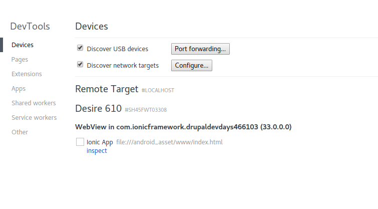

If everything is working fine you should see a request to _http://api.devicepush.com/mobile/b667-581f-3e94-904c/senderid/_ 
in the network tab with a json as a response:
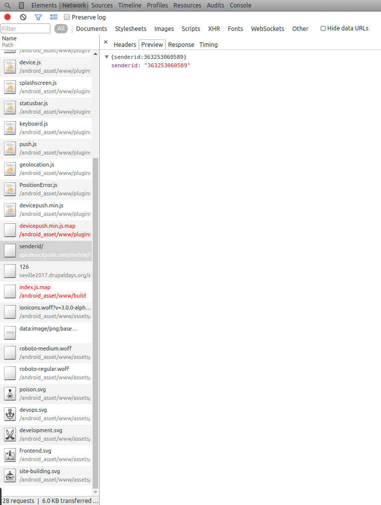

We also should be able to see the device in the devices list of our DevicePush dashboard:
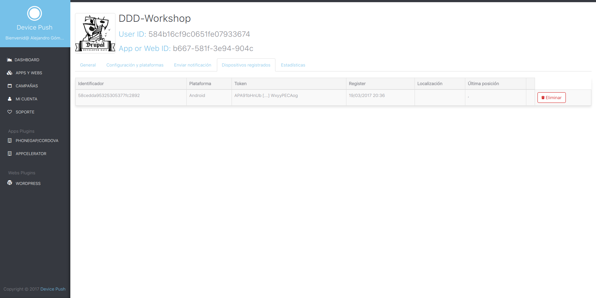

Now it's really easy to send notifications using the device push dashboard!
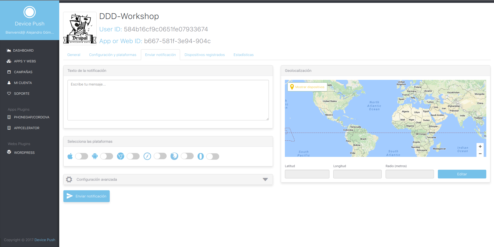

And our device should be receiving notifications:

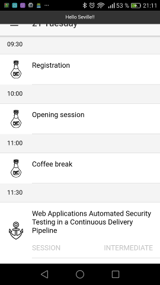 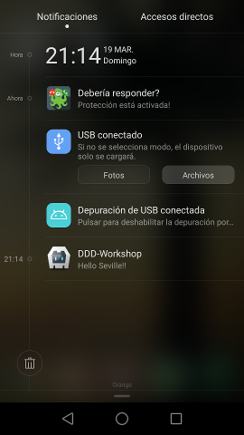

## 3. Integrating the Calendar

To add the Calendar feature we will use the [calendar plugin](http://ionicframework.com/docs/v2/native/calendar/)
As the documentation states we need to add the calendar plugin by typing in the project's root folder:
```bash
ionic plugin add cordova-plugin-calendar
```

Now we are ready to start working on our calendar feature. We will start by creating a new calendar provider class.
```bash
ionic g provider calendar
```

We rename the file and the class to **calendar.service.ts** and **CalendarService**, we remove the **Http** dependency 
and finally we add the CalendarService to the providers list in the **app.module.ts** file.
This class will have a public method: **addSession**. This method will be responsible of adding an event to the device's 
calendar there isn't an event already created to prevent duplications.
The plugin API is really easy to implement and is based on **Promises** so our method will respond with a Promise of a 
custom object with a message and a status of the operation. We will use promise chaining to achieve this:
```typescript
addSession(session: SessionDetails, startDate: Date, endDate: Date): Promise<string> {

  return Calendar.findEvent(session.title, null, null, startDate, endDate)
                 .then(
                   calendarEvent =>
                     calendarEvent && calendarEvent.length ?
                       { status: 'warn', message: 'Event already added' } :
                       this.createEvent(session, startDate, endDate),
                   () => Promise.reject({
                     status: 'error',
                     message: 'Error adding event to Calendar\nReview your permissions'
                   })
                 );
}

private createEvent(session: SessionDetails, startDate: Date, endDate: Date): Promise<any> {
  return Calendar.createEvent(session.title, 'Seville, Fuerte de Isla Mágica', session.description, startDate, endDate)
                 .then(
                   () => ({ status: 'success', message: 'Event added to your calendar' }),
                   () => Promise.reject({
                     status: 'error',
                     message: 'Error adding event to Calendar\nReview your permissions'
                   })
                 );
}
```

Remember to add the corresponding imports to Calendar and SessionDetails:
```typescript
import { SessionDetails } from '../shared/session-details';
import { Calendar } from 'ionic-native';
```

Next we must add something in our Session page to call this method. In this case we will use a 
[Ionic button](http://ionicframework.com/docs/v2/components/#buttons):
```html
<button ion-button block color="dark" (click)="addToCalendar()">Add to calendar</button>
```

Our application should look like this now:

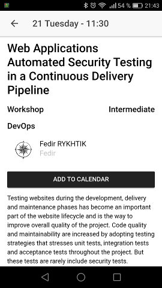

The last step now is adding the corresponding method in our Session class:
```typescript
addToCalendar() {
  const startTime = this.navParams.get('startTime').split(':');
  const endTime = this.navParams.get('endTime').split(':');
  const startDate = moment(this.navParams.get('date')).hour(startTime[0]).minute(startTime[1]);
  const endDate = moment(this.navParams.get('date')).hour(endTime[0]).minute(endTime[1]);

  this.calendarService.addSession(this.session, startDate.toDate(), endDate.toDate());
}
```
In this method we get the start and end dates and call the corresponding service method. Don't forget to add the service 
injection in your controller as we have been doing.

Once we try to add an event to the calendar for the first time the plugin will handle itself the permissions and will 
show a screen asking the user for the corresponding permission:

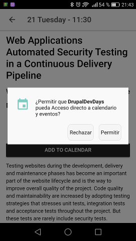

If you allow the app to access the calendar our event should be now in our calendar:

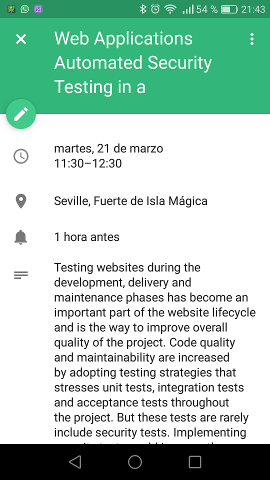

## 4. Adding feedback to improve the UX

We have our feature working fine now but, let's be sincere, the UX is really poor, there is no way for the user to know 
if the event has been added to the Calendar. We must improve this and we will use another Ionic component, the 
[**toast component**](http://ionicframework.com/docs/v2/components/#toast).

We need to use the result of the promise to show the corresponding toast so we will change our call to the CalendarService:
```typescript
this.calendarService.addSession(this.session, startDate.toDate(), endDate.toDate())
  .then(res => this.showToastMessage(res))
  .catch(res => this.showToastMessage(res));
```

And the showToastMessage will relay on the [toast controller api](http://ionicframework.com/docs/v2/api/components/toast/ToastController/) 
to create and present the toast message:
```typescript
private showToastMessage(toastContent: any) {
  const toast = this.toastCtrl.create({
    message: toastContent.message,
    duration: 3000,
    cssClass: toastContent.status
  });

  toast.present();
}
```

Finally we need to add some general styling to the toast messages. Considering that this styles are global we will use 
the app.scss file to add the following styles:
```scss
ion-toast {
  &.success {
    .toast-wrapper {
      background-color: map_get($colors, secondary);
    }
  }

  &.warn {
    .toast-wrapper {
      background-color: map_get($colors, warn);
    }
  }

  &.error {
    .toast-wrapper {
      background-color: map_get($colors, danger);
    }
  }
}
```

We are using here the variables defined in the theme (variables.scss) but the warn color is not defined, so we will add it:
```scss
$colors: (
        primary: #387ef5,
        secondary: #32db64,
        warn: #ffdf16,
        danger: #f53d3d,
        light: #f4f4f4,
        dark: #222
);
```

Now we have a much better UX.

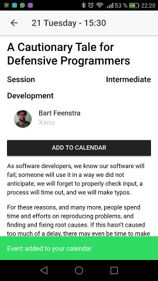 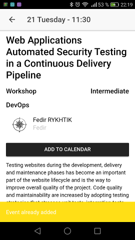 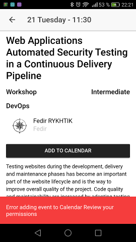

Jump to the next branch [Step 06 What to do next](https://github.com/natete/DrupalDevDays-Ionic2-Workshop/tree/Step06-What_to_do_next) finish the Workshop!
