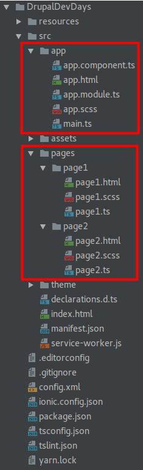
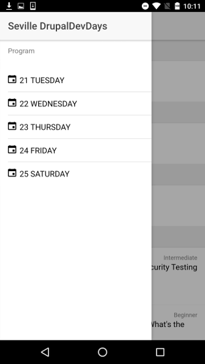
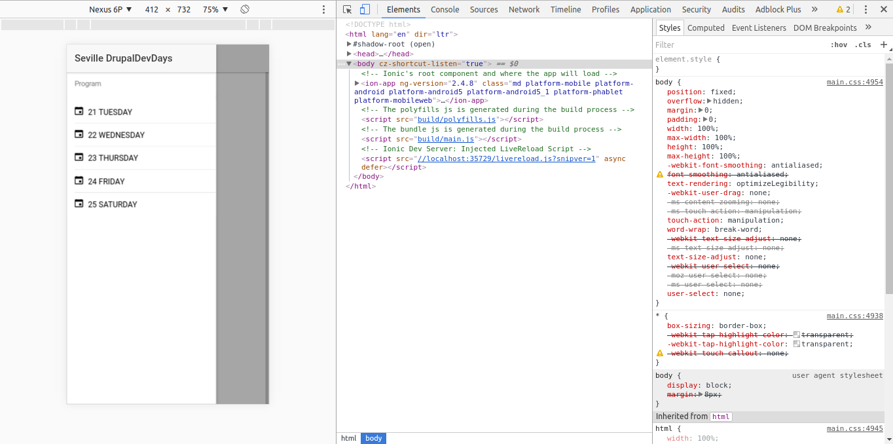
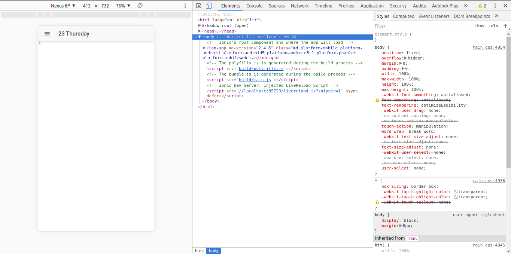

# Step 02 Preparing the Ionic application

[**1. Overview**](#1-overview)

[**2. Rename given pages**](#2-rename-given-pages)

[**3. Populate the side menu**](#3-populate-the-side-menu)

[**4. Enable navigation to the program page**](#4-enable-navigation-to-the-program-page)

[**5. Navigation params**](#5-navigation-params)

## 1. Overview

Our application lives in the src folder and should look like this:


 
Inside of this folder there are two folders we must pay attention to by now:

* **app**: it's the main folder of the app, where the application when it starts and where we configure the main module of our application. This folder contains five files:

  * _app.component.ts_: is the controller of this first view. This is where we will define the items of the side menu and where we will take the actions needed on the application startup.
  * _app.html_: is the first view to be loaded. In our case it's where the side menu is defined.
  * _app.module_: this is where we configure the Angular module of the applications. We must declare here the pages and providers we use in the application.
  * _app.scss_: where we define the global styles of the application.
  * _main.ts_: where the underlying Angular application is bootstrapped.

* **pages**: it's where our pages live (we can associate the idea of a page with the idea of a view o our app). Each page, usually is built with three files:

  * _the markup file_: a html file with the markup of the page.
  * _the styles file_ a scss file with the styles of the page.
  * _the typescript file_: this file acts as the controller of the view and is where we add behavior to the view.
  
## 2. Rename given pages

Our application uses just two views so we will recycle the ones the Ionic CLI gave us to meet our needs.
So we need to rename _page1_ folder and files to _program_. If your IDE doesn't dispose of refactoring tools you must make the following changes in the following files.

* **program.ts**:  
  * Change the selector name from _page-page1_ to _page-program_
  * Change the templateUrl from _page1.html_ to _program.html_
  * Change the class name from _Page1_ to _ProgramPage_
* **program.scss**: change the selector from _page-page1_ to _page-program_
* **app.module.ts**: 
  * Change the _Page1_ import from 
    ```typescript
    import { Page1 } from '../pages/page1/page1';
    ``` 
    to 
    ```typescript
    import { ProgramPage } from '../pages/program/program';
    ```
  * Change both in *declarations* and *entryComponents* from _Page1_ to _ProgramPage_ 
  
Proceed similarly recycling Page2 into Session:

* **session.ts**:  
  * Change the selector name from _page-page2_ to _page-session_
  * Change the templateUrl from _page2.html_ to _session.html_
  * Change the class name from _Page2_ to _SessionPage_ and don't forget any reference "this.navCtrl.push(SessionPage, "
* **session.scss**: change the selector from _page-page2_ to _page-session_
* **app.module.ts**: 
  * Change the _Page2_ import from 
    ```typescript
    import { SessionPage } from '../pages/page2/page2';
    ```
    to 
    ```typescript
    import { SessionPage } from '../pages/session/session';
    ```
  * Change both in **declarations** and **entryComponents** from _Page2_ to _SessionPage_
   
Your pages folder should look like this now:


Finally to make things work again we will remove any references to Page1 and Page2 from _app.component.ts_ and we'll let
it just pointing to our ProgramPage which will act as our home page. It should look like this:

```typescript
import { Component, ViewChild } from '@angular/core';
import { Nav, Platform } from 'ionic-angular';
import { StatusBar, Splashscreen } from 'ionic-native';
import { ProgramPage } from '../pages/program/program';

@Component({
  templateUrl: 'app.html'
})
export class MyApp {
  @ViewChild(Nav) nav: Nav;

  rootPage: any = ProgramPage;

  pages: Array<{ title: string, component: any }>;

  constructor(public platform: Platform) {
    this.initializeApp();

    // used for an example of ngFor and navigation
    this.pages = [
      { title: 'Program Page', component: ProgramPage }
    ];

  }

  initializeApp() {
    this.platform.ready()
        .then(() => {
          // Okay, so the platform is ready and our plugins are available.
          // Here you can do any higher level native things you might need.
          StatusBar.styleDefault();
          Splashscreen.hide();
        });
  }

  openPage(page) {
    // Reset the content nav to have just this page
    // we wouldn't want the back button to show in this scenario
    this.nav.setRoot(page.component);
  }
}
```

Now everything should work just fine in your application and we can carry on and start with the fun part.

## 3. Populate the side menu

To start giving some content to our application we will start with the side menu. We want something like this:



First we will create an array with the options we want to show in the menu. It will be an array of dates. 
In order to work easily with dates we will install a library called [momentjs](https://momentjs.com/). In the application folder we will type:
  
```bash
yarn add moment
```
or
```bash
npm i --save moment
```

Once we have our library installed we need to import it in our app.component.ts by adding:

```typescript
import * as moment from 'moment';
```

Now we have available moment in this file and we can create an array of dates like this in our class inside the app.component.ts file:

```typescript
dates = [
  moment('2017-03-21'),
  moment('2017-03-22'),
  moment('2017-03-23'),
  moment('2017-03-24'),
  moment('2017-03-25')
];
```

Don't forget to remove the pages declaration and the use of this legacy variable we had:

```typescript
  pages: Array<{ title: string, component: any }>;
```

and 

```typescript
// used for an example of ngFor and navigation
this.pages = [
  { title: 'Program Page', component: ProgramPage }
];
```

Next we must edit the html where the side menu lives (_app.html_). First we will change the ion-title from **Menu** to 
**Seville DrupalDevDays**. Then we will add a header to the ion-list:

```html
<ion-list-header>Program</ion-list-header>
```

Now we proceed to arrange our dates buttons. We must keep the _ngFor_ to iterate through our dates so we will change the iteration to:
```typescript
let date of dates
```
Since we don't have a behavior yet for this buttons we remove from the button the action associated with the click event:
  
```typescript
(click)="openPage(p)"
```
  
We must also change the content of each button. Then we remove:
  
 ```typescript
 {{p.title}}
 ```
 
Now we start to make things look like we want to. We will set an icon and the date properly formatted of each available page. 
To add the icon we will add a [**ion-icon**](http://ionicframework.com/docs/v2/components/#icons) component and we will 
set the attribute name to _calendar_. You have a [huge set of icons](http://ionicframework.com/docs/v2/ionicons/) 
available to be used out of the box. We want to keep on the left of the button, so we will add the icon-left attribute.
  
```html
<button menuClose ion-item *ngFor="let date of dates">
  <ion-icon name="calendar"></ion-icon>
</button>
```

Finally we add the text of the button, the properly formatted date. To do so we will use the **date** variable exposed 
by the _ngFor_. This variable represents an item of the _dates_ array we defined previously. To print the content of a 
variable or expression we wrap it into double curly braces **{{}}**. We will take advantage of _momentjs_ features to 
format the date properly.

```typescript
{{date.format('DD dddd')}}
```

The final touch is display this date in uppercase. We will use, _text-uppercase_ another provided attribute utility to 
achieve it (you can check the available utils attributes [here](http://ionicframework.com/docs/v2/theming/css-utilities/)). 
We will surround the text of the button in a _span_ with the mentioned attribute. If everything went right we should have:
  
```html
<button menuClose ion-item *ngFor="let date of dates" icon-left text-uppercase>
  <ion-icon name="calendar"></ion-icon>
  <span text-uppercase>{{date.format('DD dddd')}}</span>
</button>
```

After these changes our menu should be looking something like this in Android:



## 4. Enable navigation to the program page

Now we want our side menu buttons to do something. Their task is to navigate to a date of the schedule. Then we will 
start working on our **app.component.ts** file. We create a **goToProgram** method that receives the target date as parameter.

```typescript
goToProgram(date: Moment) {

}
```

In order to use the moment type we must import it by adding 
```typescript
import Moment = moment.Moment;
```

Navigation is managed by the **NavController**. We already have **Nav** (a declarative component for a NavController) 
available using a feature of Angular 2 that allows a component to get access to a child component and its methods. In 
this case we use the Nav component, an Ionic built-in component. 

Basic navigation in ionic works like a stack and we can use it in two ways:
* **nav.setRoot(_page_)**: we use this method to change the root of the application, thus disallowing to go back and clearing the navigation stack.
* **navCtrl.push(_page_) | navCtrl.pop()**: we use these methods to add or remove pages from the navigation stack.
 
The Navigation API is much more complex than that, you can refer to [Nav](https://ionicframework.com/docs/v2/api/components/nav/Nav/) 
and [NavController](https://ionicframework.com/docs/v2/api/navigation/NavController/) documentation to explore more navigation options.

In this case we want the target program page to be the new root of our application, so our _goToProgram_ method will look like this:
  
```typescript
goToProgram(date: Moment) {
  this.nav.setRoot(ProgramPage, date);
}
```

To use this method we will attach this method to the click event of the button. In Angular 2 and Ionic 2 event binding 
is done by adding the event name surrounded by parenthesis (```(eventName)="methodToHandleTheEvent($event, params)"```). 
So in our case our button must look:
```html
<button menuClose ion-item *ngFor="let date of dates" (click)="goToProgram(date)" icon-left text-uppercase>
```

Since we are controlling the root of our application by ourselves, we must remove old default navigation controls. We must remove:
```typescript
[root]="rootPage"
```
from the _ion-nav_ tag in the _app.html_ and
```typescript
rootPage: any = ProgramPage;
``` 
from the _app.component.ts_ file.

We must also remove the legacy navigation method:
```typescript
openPage(page) {
  // Reset the content nav to have just this page
  // we wouldn't want the back button to show in this scenario
  this.nav.setRoot(page.component);
}
```

Finally we must declare a first page to be set as the root of the application on load. We can set just the first date as 
the root of our application or go a little bit further and set the root page according to the date. We will set the 
current date page as the root if it exists or the first page otherwise.

We can achieve it easily using moment. We will create a private method to handle this and we will call this method within 
the _platform.ready_ method:

Our app.component.ts should look like this by now:
```typescript
import { Component, ViewChild } from '@angular/core';
import { Nav, Platform } from 'ionic-angular';
import { StatusBar, Splashscreen } from 'ionic-native';
import * as moment from 'moment';
import { ProgramPage } from '../pages/program/program';
import Moment = moment.Moment;

@Component({
  templateUrl: 'app.html'
})
export class MyApp {
  @ViewChild(Nav) nav: Nav;

  dates = [
    moment('2017-03-21'),
    moment('2017-03-22'),
    moment('2017-03-23'),
    moment('2017-03-24'),
    moment('2017-03-25')
  ];

  constructor(public platform: Platform) {
    this.initializeApp();
  }

  initializeApp() {
    this.platform.ready()
        .then(() => {
          // Okay, so the platform is ready and our plugins are available.
          // Here you can do any higher level native things you might need.
          StatusBar.styleDefault();
          Splashscreen.hide();

          this.goToFirstDay();
        });
  }

  goToProgram(date: Moment) {
    this.nav.setRoot(ProgramPage, date);
  }

  private goToFirstDay() {
    const now = moment();

    this.goToProgram(this.dates.find(date => now.isSame(date, 'day')) || this.dates[0]);
  }
}
```

## 5. Navigation params

Now we are able to use our side menu but we don't see any effect. We need to use the **navigation params**.
The second parameter we passed to the _setRoot_ method is the navigation params. This is simple way to communicate pages.
So, next we can start working on our **ProgramPage** to use this parameters.

First of all we will remove the example content of the **program.html** file. This content is inside of the _ion-content_ tag. 
We must also remove the _padding_ attribute from the ion-content since we don't want any padding in our component.
The header bar is working fine for us but we don't want the _Page One_ title. Instead we want to show the date of the 
Program Page we are.

So we substitute this _Page One_ with the content of a variable we will create called **title**. 
Again, to print the content of this variable we need to wrap it in double curly braces.
```
{{title}}}
```

Next we must declare and populate this _title_ variable. To do so we must work on **program.ts** and add the variable declaration:
```typescript
title: string;
```

Then we must populate it with the data we receive from the navigation. To access this data we need an instance of **NavParams**. 
We will use dependency injection to get it, so we must add a second parameter to the constructor leaving our constructor like this:
```typescript
constructor(public navCtrl: NavController,
            private navParams: NavParams) { }
```
Remember to add the corresponding import (```import { NavController, NavParams } from 'ionic-angular';```) if your IDE doesn't do it for you.
Now we can access the params of the navigation and use them to populate our title variable adding this to the constructor:
```typescript
this.title = (this.navParams.data as Moment).format('DD dddd');
```

_navParams.data_ is of type _any_ so we must cast it to _Moment_ to access its methods and format the date properly to be 
shown in the title. We do this using the **as** reserved word. (Remember to add the needed momentjs imports as we did before).
 
Now we can check how the title is changing when we select a different date.



Jump to the next branch [Step 03 Populating the Program Page](https://github.com/natete/DrupalDevDays-Ionic2-Workshop/tree/Step03-Populating_the_Program_Page) to keep coding!
