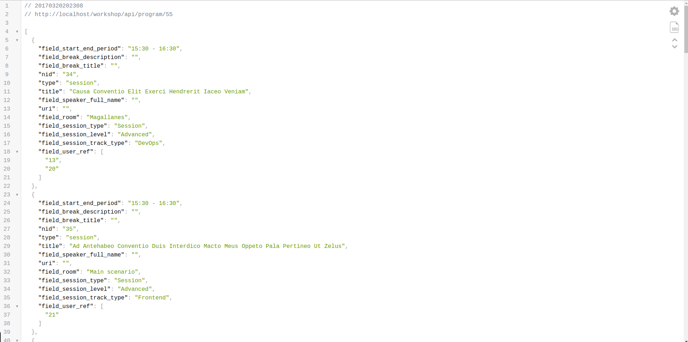

# Step00 Setting up Drupal

Before we start with the Ionic project we need a Drupal instance with the API we are going to consume.
We will start cloning [the DrupalDevDays repo](https://github.com/AsociacionDrupalES/devdaysseville) and following the installation instructions.
Once it's installed you can use [the provided db dump](./dump.sql) to add a program to your DrupalDevDays instance.

```bash
../vendor/bin/drush sql-cli < path-to-your-downloaded-file/dump.sql
```

Finally get your ip to use it in your Ionic application. If everything went fine you should be able now to access your API.
Type into your browser's address bar: 
```
http://your-ip/devdaysseville/api/program/55
```

And you should get something like this:



Jump to the next branch [**Step 01 Installing Ionic**](https://github.com/natete/DrupalDevDays-Ionic2-Workshop/tree/Step01-Installing_Ionic) to keep coding!
